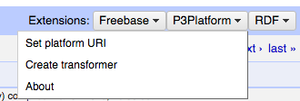
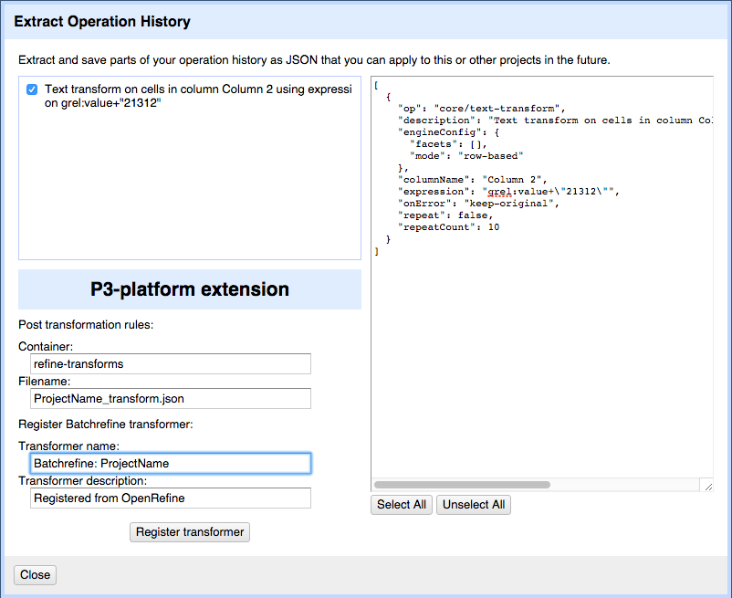

# p3-openrefine-extension
OpenRefine extension simplifying user interaction with P3 Platform from OpenRefine

### Install and build
You will need an OpenRefine installed on your system.<br>
Go to `OpenRefine` root directory:
```
cd extensions

git clone https://github.com/fusepoolP3/p3-openrefine-extension.git
```

In `extensions` directory modify `build.xml` to include `build` and `clean` tasks:
```
...
<project name="openrefine-extensions" default="build" basedir=".">
  <target name="build">
    <echo message="Building extensions" />
    <ant dir="jython/" target="build" />
    <ant dir="p3-openrefine-extension/" target="build" />

...

  <target name="clean">
    <echo message="cleaning extensions" />
    <ant dir="jython/" target="clean" />
    <ant dir="freebase/" target="clean" />
    <ant dir="p3-openrefine-extension/" target="clean" />

...
</project>
```

OpenRefine build will also build the extension:<br>
From OpenRefine root directory run:
```
ant clean build
```

### Usage
Click on the `P3Platform` button on the extensions bar:



1. Configure the P3 platform endpoint

2. Register P3 transformer from your OpenRefine transformation rules

